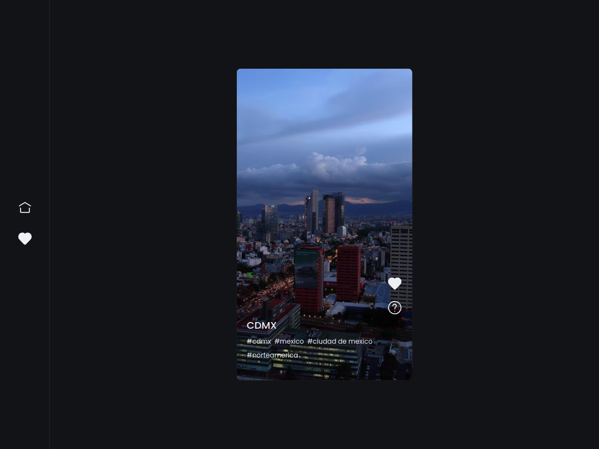

# 🤖 TikTok Clone

Un clon de tiktok con la funcionalidad básica del scroll infinito y agregar video a favoritos.

## 🖼️ Screenshots



## 🚀 ¿Como usar?

Primero clona el repositorio desde GitHub.

```shell
git clone https://github.com/JoseLuria/tiktok-clone.git
```

Muévete a la carpeta del proyecto.

```shell
cd tiktok-clone
```

Instala las dependencias con el siguiente comando:

```shell
npm install
```

Por último, inicia el servidor con el siguiente comando:

```shell
npm run dev
```

## ⚙️ Esta aplicación fue construida usando las siguientes tecnologías

- [Next Js](https://nextjs.org/)
- [SASS](https://sass-lang.com/)
- [Framer Motion](https://www.framer.com/docs/animation/)
- [Redux Toolkit](https://redux-toolkit.js.org/)
- [Cloudinary](https://cloudinary.com/)
- [MongoDB](https://www.mongodb.com/)

## 📄 Licencia

[MIT](https://opensource.org/licenses/MIT)
